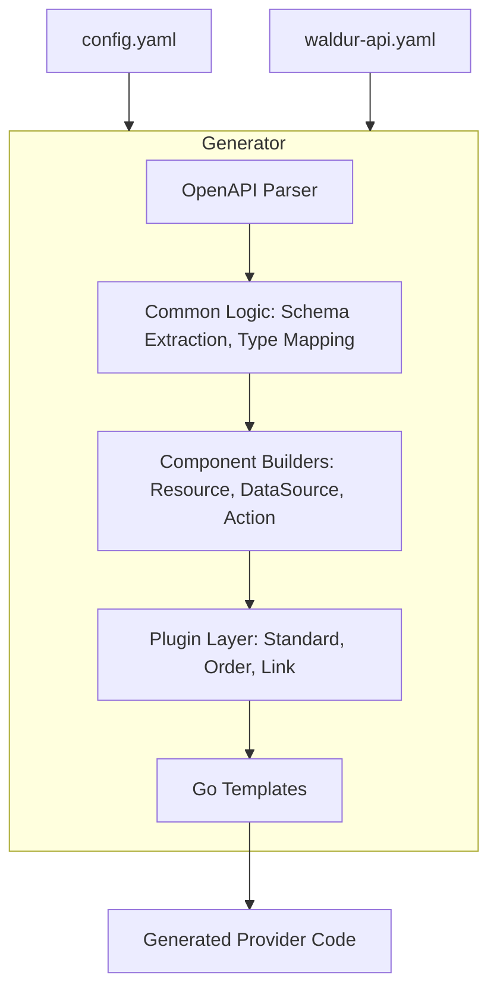

# Terraform Waldur Provider Generator

A Go-based code generator that creates a Terraform provider plugin for managing hybrid cloud computing infrastructure using the [Waldur](https://waldur.com/) REST API.

## Overview

This generator reads a Waldur OpenAPI schema and a YAML configuration file to automatically generate a complete Terraform provider using the modern [Terraform Plugin Framework](https://developer.hashicorp.com/terraform/plugin/framework). The generated provider can be tested, built, and published to the Terraform Registry.

## Features

- ✅ **Convention-based configuration**: Minimal YAML config using `base_operation_id` for automatic operation inference
- ✅ **Modern Terraform Plugin Framework**: Uses the latest Plugin Framework (protocol 6.0)
- ✅ **Standard Timeouts**: Supports customizable `timeouts` for Create, Update, and Delete operations
- ✅ **OpenAPI schema parsing**: Automatically infers schemas and operations from OpenAPI definitions
- ✅ **Multi-platform builds**: Generates providers for Linux, macOS, and Windows
- ✅ **Registry-ready**: Includes GoReleaser config and a GitLab CI release pipeline for automated publishing
- ✅ **Modular resource naming**: Supports module-prefixed resources (e.g., `structure_project`, `openstack_instance`)
- ✅ **E2E Testing with go-VCR**: Full CRUD lifecycle testing with recorded API interactions

## Architecture

The generator follows a modular component-based architecture designed for extensibility and determinism.



For more details on the design principles and architecture, see the **[Developer Guide](docs/DEVELOPER_GUIDE.md)**.

## Installation

### Prerequisites

- Go 1.24 or later
- Access to Waldur OpenAPI schema file

### Install from source

```bash
git clone https://code.opennodecloud.com/waldur/terraform-provider-waldur-generator.git
cd terraform-provider-waldur-generator
go install
```

Or install directly via the GitHub mirror, which is what the Go module path
resolves to:

```bash
go install github.com/waldur/terraform-provider-waldur-generator@latest
```

## Usage

### 1. Create Configuration File

Create a `config.yaml` file that defines the resources and data sources you want to generate:

```yaml
generator:
  openapi_schema: "path/to/waldur-openapi.yaml"
  output_dir: "output"
  provider_name: "waldur"

resources:
  - name: "structure_project"
    base_operation_id: "projects"
    
  - name: "openstack_instance"
    base_operation_id: "openstack_instances"
    
data_sources:
  - name: "structure_project"
    base_operation_id: "projects"
```

**Convention-based Operation Inference:**

For each `base_operation_id`, the generator automatically looks for these operations in the OpenAPI schema:

- `{base}_list` - List/read all resources (GET)
- `{base}_create` - Create resource (POST)
- `{base}_retrieve` - Read single resource (GET with ID)
- `{base}_partial_update` - Update resource (PATCH)
- `{base}_destroy` - Delete resource (DELETE)

### 2. Run the Generator

```bash
./terraform-provider-waldur-generator -config config.yaml
```

Or if running from source:

```bash
go run main.go -config config.yaml
```

### 3. Build the Generated Provider

```bash
cd output
go mod tidy
go build
```

### 4. Test the Provider

```bash
# Run unit tests
cd output
go test ./... -v

# Run acceptance tests (requires TF_ACC=1)
TF_ACC=1 go test ./... -v
```

### 5. E2E Testing with go-VCR

The generator includes support for End-to-End (E2E) testing using [go-VCR](https://github.com/dnaeon/go-vcr), which records and replays HTTP interactions with the Waldur API.

This allows for:

- ✅ **Testing without live API dependencies** (Replay mode)
- ✅ **Deterministic and fast CI execution**
- ✅ **Verification of full CRUD lifecycles**

**Quick Start in Replay Mode:**

```bash
cd output

TF_ACC=1 go test ./e2e_test -v
```

For detailed instructions on setup, recording new cassettes, and writing tests, please refer to the **[E2E VCR Testing Guide](docs/E2E_TEST_SETUP.md)**.

### 5. Test Locally Without Publishing

You can test the built provider locally without publishing it to the Terraform Registry using Terraform's [development overrides](https://developer.hashicorp.com/terraform/cli/config/config-file#development-overrides-for-provider-developers).

#### Step 1: Build and install the provider binary

```bash
cd output
go build -o terraform-provider-waldur

# Create the local plugin directory
mkdir -p ~/.terraform.d/plugins/registry.terraform.io/waldur/waldur/1.0.0/linux_amd64

# Copy the provider binary with the correct naming convention
cp terraform-provider-waldur ~/.terraform.d/plugins/registry.terraform.io/waldur/waldur/1.0.0/linux_amd64/terraform-provider-waldur_v1.0.0
```

**Note:** Adjust the platform directory (`linux_amd64`) based on your OS and architecture:

- Linux AMD64: `linux_amd64`
- macOS AMD64: `darwin_amd64`
- macOS ARM64 (M1/M2): `darwin_arm64`
- Windows AMD64: `windows_amd64`

#### Step 2: Create or edit `~/.terraformrc`

Create a Terraform CLI configuration file at `~/.terraformrc` (or `%APPDATA%/terraform.rc` on Windows) with the following content:

```hcl
provider_installation {
  dev_overrides {
    "registry.terraform.io/waldur/waldur" = "/home/your-username/.terraform.d/plugins/registry.terraform.io/waldur/waldur/1.0.0/linux_amd64"
  }

  # For all other providers, install them directly as normal.
  direct {}
}
```

**Important:**

- Replace `/home/your-username/` with your actual home directory path
- Adjust the platform directory to match your OS (see Step 1)

#### Step 3: Use the provider in your Terraform configuration

Create a test Terraform configuration (e.g., `test.tf`):

```hcl
terraform {
  required_providers {
    waldur = {
      source = "registry.terraform.io/waldur/waldur"
    }
  }
}

provider "waldur" {
  endpoint     = "https://your-waldur-instance.com"
  token = "your-api-token"
}

# Test with a data source
data "waldur_structure_project" "test" {
  name = "My Project"
}

output "project_uuid" {
  value = data.waldur_structure_project.test.id
}
```

#### Step 4: Run Terraform

**Important:** When using `dev_overrides`, **skip `terraform init`** and go directly to `terraform plan`:

```bash
terraform plan
terraform apply
```

When using `dev_overrides`, Terraform will display a warning:

```text
Warning: Provider development overrides are in effect
```

This is expected and confirms that Terraform is using your locally built provider instead of downloading from the registry.

#### Step 5: Clean up (optional)

When you're done testing, remove or comment out the `dev_overrides` section from `~/.terraformrc` to return to normal provider installation behavior.

## Generated Provider Structure

The generator creates a complete provider with the following structure:

```text
output/
├── main.go                          # Provider entry point
├── go.mod                           # Go module
├── internal/
│   ├── provider/                    # Provider implementation
│   ├── client/                      # API client logic
│   ├── sdk/                         # Generated Go SDK for Waldur
│   └── testhelpers/                 # Test utilities
├── services/                        # Service-specific resources
│   ├── core/                        # Core resources/datasources
│   ├── marketplace/                 # Marketplace resources/datasources
│   └── ...                          # Other Waldur services
├── e2e_test/                        # End-to-end acceptance tests
├── examples/                        # HCL examples for the Registry
├── .gitlab-ci.yml                   # Release pipeline (runs on v* tags)
├── .goreleaser.yml                  # Release configuration
└── terraform-registry-manifest.json  # Metadata for Terraform Registry
```

## Publishing to Terraform Registry

Releases are cut by the **GitLab** pipeline in the downstream repo
(`waldur/terraform-provider-waldur`), generated from
`internal/generator/templates/release.yml.tmpl`. It runs on tags matching `v*`.

The Terraform Registry only ingests **GitHub** releases, so goreleaser is pointed at the GitHub
mirror explicitly via `release.github` in `.goreleaser.yml`; the GitLab tag reaches GitHub by
repository mirroring. This is why the job needs a GitHub token even though it runs on GitLab.

### 1. Signing key

The Registry validates the signature on every release against a public key registered to the
namespace, so reuse the existing key rather than generating a new one. A new key must first be added
under Terraform Registry → User Settings → Signing Keys:

```bash
gpg --armor --export <key-id>            # public, for the Registry
gpg --armor --export-secret-keys <key-id> # private, for CI
```

### 2. CI/CD variables

Set these on **`waldur/terraform-provider-waldur`** (Settings → CI/CD → Variables), not on this
repo — the release job runs downstream:

| Variable | Notes |
|----------|-------|
| `GPG_PRIVATE_KEY` | Private key. Do **not** mask it: masking requires single-line values and mangles the armored block. Use an unmasked variable, a File-type variable, or store it base64-encoded — the job accepts either form. |
| `GPG_PASSPHRASE` | Passphrase for that key. (Named `PASSPHRASE` under the old GitHub Actions workflow — rename when migrating.) |
| `GITHUB_TOKEN` | GitHub PAT with `contents: write` on `waldur/terraform-provider-waldur`. Required because the release is published to GitHub. |

`GPG_FINGERPRINT` is derived from the imported key at runtime and is not a variable.

### 3. Cut a release

Run the generator pipeline with the version to release — this is what tags the downstream repo:

```bash
glab ci run -b main --variables-env RELEASE_VERSION:8.1.3 \
  --repo waldur/terraform-provider-waldur-generator
```

Prereleases work too (`RELEASE_VERSION:8.1.3-rc.1`) and are flagged automatically via
`release.prerelease: auto`. Note that Terraform only ever installs a prerelease from an **exact**
version pin — a range such as `>= 8.1` silently skips them.

The deploy job **skips tagging if the tag already exists**, so a re-run of the same version syncs
code and publishes nothing. Bump the version instead of retrying the same one.

The pipeline then builds every platform, checksums and GPG-signs the artifacts, publishes a GitHub
release, and the Registry picks it up.

## Configuration Reference

### Generator Section

| Field | Type | Required | Description |
| :--- | :--- | :--- | :--- |
| `openapi_schema` | string | Yes | Path to Waldur OpenAPI schema file |
| `output_dir` | string | No | Output directory (default: `output`) |
| `provider_name` | string | Yes | Provider name (e.g., `waldur`) |

### Resources and Data Sources

| Field | Type | Required | Description |
| :--- | :--- | :--- | :--- |
| `name` | string | Yes | Resource/data source name (with module prefix) |
| `base_operation_id` | string | Yes | Base operation ID for convention-based inference |

## Development

### Project Structure

```text
terraform-provider-waldur-generator/
├── main.go                      # CLI entry point
├── internal/
│   ├── config/                  # Configuration parsing
│   ├── openapi/                 # OpenAPI schema parsing
│   └── generator/               # Code generation logic
│       ├── common/              # Shared logic (schema, logic, utils)
│       ├── components/          # Template data prep (resource, datasource, list, action)
│       ├── plugins/             # Resource flavors (standard, order, link)
│       ├── templates/           # Go template files (.tmpl)
│       └── ...                  # Generator modules (sdk, client, scaffold)
├── output/                      # Generated provider (git-ignored)
├── config.yaml                  # Generator configuration
└── waldur_api.yaml              # Waldur OpenAPI specification
```

### Running Tests

```bash
go test ./... -v
```

### Building

```bash
go build -o terraform-provider-waldur-generator
```

## Contributing

Contributions are welcome! Please feel free to submit a Pull Request.

## License

MIT License - see [LICENSE](LICENSE) file for details.

## Links

- [Waldur](https://waldur.com/)
- [Terraform Plugin Framework](https://developer.hashicorp.com/terraform/plugin/framework)
- [Terraform Registry](https://registry.terraform.io/)
- [OpenAPI Specification](https://spec.openapis.org/oas/v3.1.0)
