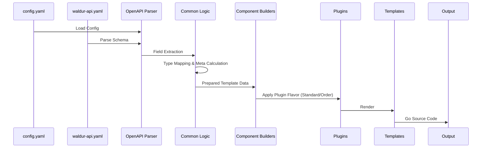

# Developer Guide: Waldur Terraform Provider Generator

Welcome to the internal guide for developing and maintaining the Waldur Terraform Provider Generator. This document deep-dives into the architecture, design principles, and technical nuances of the system.

## Architecture Deep Dive

The generator is built as a pipeline that transforms an OpenAPI specification into a functional Terraform provider.

### 1. The Pipeline



### 2. Core Packages

* **`internal/generator/components/`**: Orchestrates the generation of specific Terraform components (Resources, DataSources, Actions).
* **`internal/generator/plugins/`**: Implements specialized logic for different resource "flavors":
  * **Standard**: Default CRUD.
  * **Order**: Handles Waldur's Marketplace "Order" pattern where object creation happens via a separate endpoint and follows an async state machine.
  * **Link**: Handles M:N or 1:N relations (e.g., attaching a volume to a server).
* **`internal/generator/common/`**: The "brain" of the generator.
  * `schema.go`: Extracts `FieldInfo` recursively from OpenAPI.
  * `merging.go`: Combines fields from different operations (e.g., Create Request + Retrieve Response).
  * `sdk_types.go`: Determines Go types for the SDK layer.
  * `utils.go`: String manipulation and humanization.

## Filesystem Layout

### 1. Generator Project Structure

```text
terraform-provider-waldur-generator/
├── main.go                      # CLI entry point
├── internal/
│   ├── config/                  # Configuration parsing (Go types for config.yaml)
│   ├── openapi/                 # OpenAPI schema parsing
│   └── generator/               # Core generation logic
│       ├── common/              # Shared logic (schema extraction, types, utils)
│       ├── components/          # Template data preparation (resource, datasource, etc.)
│       ├── plugins/             # Resource flavor logic (standard, order, link)
│       ├── templates/           # Go template files (.tmpl)
│       ├── generator.go         # Orchestrates the generation pipeline
│       ├── sdk_generator.go     # Generates the Go SDK for the provider
│       ├── client_generator.go  # Generates the API client
│       └── scaffold_generator.go# Scaffolds the provider project structure
├── output/                      # Default generation target (git-ignored)
├── config.yaml                  # Generator configuration reference
└── waldur_api.yaml              # Source Waldur OpenAPI specification
```

### 2. Generated Provider Structure

```text
output/
├── main.go                          # Provider entry point
├── go.mod                           # Go module for the provider
├── internal/
│   ├── provider/                    # Provider initialization and config
│   ├── client/                      # API client logic
│   ├── sdk/                         # Auto-generated Go SDK
│   └── testhelpers/                 # Shared utilities for acceptance tests
├── services/                        # Service-oriented resource grouped by domain
│   ├── core/                        # e.g., structure and keys
│   ├── marketplace/                 # e.g., orders and resources
│   └── ...                          # Other Waldur services
├── e2e_test/                        # End-to-end acceptance tests
├── examples/                        # HCL examples for Terraform Registry
├── .goreleaser.yml                  # Release configuration for multiple platforms
└── terraform-registry-manifest.json  # Metadata for Terraform Registry
```

## Design Principles

### 1. Determinism is Mandatory

The generator must produce **byte-identical code** on every run.

* **Sorting**: All map iterations must be sorted lexicographically before generation.
* **Stability**: Avoid using random hashes; use content-based hashing (MD5/SHA) for naming anonymous structures.

### 2. Configuration over Code

Avoid hardcoding service-specific logic in Go.

* Use `config.yaml` for field exclusions (`excluded_fields`), type overrides (`set_fields`), and specialized logic triggers.
* The `common.SchemaConfig` should act as the single source of truth for global generation parameters.

### 3. Logic in Go, Not Templates

Keep Go templates (`.tmpl`) as thin as possible.

* Perform all complex transformations, field humanization, and type mapping in the Go pipeline before rendering.
* Templates should focus on the structure and syntax of the generated code.

## Nuances & Trade-offs

### Waldur Marketplace Orders

One of the most complex parts of the project. Marketplace resources do not have a standard "POST to collection" creation flow. Instead, they require creating an "Order" in the marketplace service. The generator handles this via the `order` plugin, which:

1. Takes fields from the offering schema.
2. Merges them with the resource schema.
3. Injects logic to wait for the order to complete before returning the resource ID.

### Recursive Schemas

Terraform Plugin Framework supports nested attributes, but Go's static typing requires representing these as structs. The generator automatically flattens and deduplicates nested structures, assigning stable names (e.g., `BaseUserAddress`) to anonymous objects.

## Tips & Tricks

### Debugging the Generator

* **Verbose Output**: Use the `-v` flag if available to see the internal data pipeline.
* **Template Inspection**: Look at `internal/generator/templates/shared/schema.tmpl`. It uses aggressive whitespace trimming (`{{-` and `-}}`) to keep the generated code clean.

### Writing New Templates

* Always use `MarkdownDescription` for attributes.
* Leverage `renderValidators` in `shared.tmpl` for consistent validation logic across all types.

## Testing Strategy

1. **Unit Tests**: Located in `internal/generator/common/` and other packages. These test the generator's internal logic.
2. **Generated E2E Tests**: The generator produces acceptance tests in `output/e2e_test/`. These are the final verification that the generated code actually works against a Waldur API (real or VCR).
3. **go-VCR**: Use VCR recorded cassettes for deterministic CI runs. See `E2E_TEST_SETUP.md` for more.
